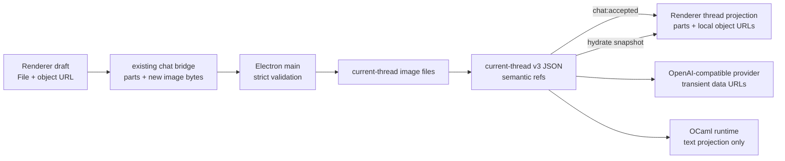

# Experiment 01：上下文 Composer 技术方案

> Status: Ready v1.0 — independent gate PASS
>
> Plan ID: `context-composer-exp-01`
>
> 这是一份待收敛的实现方案，不是当前 scope 授权。只有在本方案通过 convergence 与独立技术审查、用户再次明确开始实现后，才能把它加入仓库的限界 workstream。

## 一句话结论

第一轮只做一个纵向闭环：**PNG/JPEG 图片通过粘贴、拖放或选择进入 Composer，作为有序 user message parts 被 Electron main 验证并持久化，随后映射为 OpenAI-compatible Chat Completions 图片输入；assistant 输出、Provider resolver、Connections 和 OCaml 协议全部保持现状。**

这不是“上传系统”的第一版，也不是为未来搭 Asset 平台。它只增加当前单线程聊天真正需要的图片文件目录、引用关系和生命周期。

## 已拍板的边界

| 问题          | 决定                                                                                                                          |
| ------------- | ----------------------------------------------------------------------------------------------------------------------------- |
| 第一轮输入    | 文字、PNG、JPEG；支持 text-only、image-only、text + images                                                                    |
| 进入方式      | 原生 file input、系统粘贴、拖放                                                                                               |
| 内容模型      | user message 使用有序 `text` / `image` parts；assistant 仍是单段文字                                                          |
| 图片存储      | Electron main 管理当前 thread 的一个图片目录；JSON 只存引用，不存 Base64                                                      |
| Provider 传输 | main 在请求前读取去 metadata 后的 canonical 图片并临时转成 data URL；只在含图 user message 上使用 content array               |
| 发送确认      | main 落盘 user turn 与图片后发出 `chat:accepted`；确认前 Composer 不清空                                                      |
| 能力判断      | 现有 target 没有可信能力数据，一律按 `unknown` 诚实尝试；不猜模型名，不新增 capability registry                               |
| 失败恢复      | 图片请求被目标拒绝时保留 durable user turn，允许切换 target 后 Retry                                                          |
| Runtime       | OCaml 只接收用户文字投影；image-only 投影为空字符串，不传图片或引用                                                           |
| 回滚          | 一旦写入 v3，回退版本必须保留 reader、图片读取/展示、历史 Provider 重建、Retry 与缺图 fail-closed；不承诺旧 binary 读取新记录 |

## 目标与完成标准

这次只验证一个体验问题：图片能否像文字一样自然地成为本轮上下文，而不引入模式切换和数据焦虑。

完成时必须同时成立：

1. 用户可以粘贴截图、拖入图片或打开系统选择器。
2. Composer 内可以预览和删除图片；没有文字也能发送。
3. 发送确认前发生任何校验或落盘失败，文字和图片仍留在 Composer。
4. 发送确认后，用户消息中的图片与文字在当前会话和应用重启后都可读。
5. 至少一个真实 OpenAI-compatible 多模态 target 能收到正确图片并返回现有文字流。
6. Unknown target 拒绝图片后，用户可以切换 target 并 Retry，同一图片不重复导入。
7. Stop、Retry、restart、New thread、target attribution 与 text-only 请求行为不回退。
8. Provider 收到的是去除 EXIF/文本块等 metadata 后的 canonical 像素内容，不会附带用户不可见的位置、设备或拍摄信息。

## 明确不做

- PDF、Word、文本附件、音频、视频、HEIC、SVG、GIF、WebP。
- 图片压缩设置、裁剪、标注、OCR、圈选、拖动排序。
- 富文本编辑器或 `contenteditable` Composer。
- assistant 图片输出、typed rich stream、Artifact、HTML 渲染。
- 通用 Asset entity、数据库、哈希去重、引用计数、云上传、跨 thread 共享。
- Provider adapter registry、Connections schema 迁移、手工 capability 配置、模型名推断。
- 新 IPC namespace、自定义文件协议、新 OCaml action 或 Electron ↔ OCaml 消息。
- 为暂不存在的多窗口或多线程历史做同步与 GC 设计。

一旦真实 target 只接受“先上传文件，再传 URL/file id”，立即停止本实验，不把远程上传偷偷塞进这一轮。

## 证据边界

### 仓库事实

- Renderer 当前在主进程持久化前就清空输入并乐观插入消息；`startChat` IPC 自身不会等待持久化完成。[`chat-reducer.ts`](../../apps/desktop/src/ui/chat/chat-reducer.ts) [`session.ts`](../../apps/desktop/electron/main/chat/session.ts)
- current-thread v2 只接受非空 `userContent` 字符串，无法表达 image-only；store 已具备严格 schema、原子 JSON 写入、稳定 turn identity 与懒迁移模式。[`schemas.ts`](../../apps/desktop/electron/main/current-thread/schemas.ts) [`store.ts`](../../apps/desktop/electron/main/current-thread/store.ts)
- Provider 请求映射集中在一个纯函数边界，text-only body 已有精确回归测试。[`client.ts`](../../apps/desktop/electron/main/chat/client.ts)
- target catalog 和 resolved target 都没有 capability；现有方向也禁止按 hostname 或 model name 猜能力。[`provider-adapter-direction.md`](provider-adapter-direction.md)
- OCaml runtime 是可重建的文字状态投影，Provider context 的真实来源仍是 Electron main 的 durable record。[`runtime-protocol.md`](../architecture/runtime-protocol.md)

### 外部事实

- Electron IPC 使用 Structured Clone，不能把 DOM `File` 或 `ImageBitmap` 直接发给 main；Renderer 必须先转成可序列化字节。[Electron ipcRenderer](https://www.electronjs.org/docs/latest/api/ipc-renderer)
- Electron `nativeImage.createFromBuffer` 原生尝试解码 PNG/JPEG，并提供 `toPNG` / `toJPEG` 重编码；配合解码前 header 限制，可以完成首轮的可解码性检查与 metadata 清除，不引入图片处理依赖。[Electron nativeImage](https://www.electronjs.org/docs/latest/api/native-image)
- OpenAI 官方确认 `/v1/chat/completions` 可接收图片输入，但这不证明任意 OpenAI-compatible target 或任意 model 都支持同一形状，所以真实 target fixture 与 runthrough 仍是放行条件。[OpenAI data controls](https://developers.openai.com/api/docs/guides/your-data#image-and-file-inputs)

## 所有权保持不变



- Renderer 拥有未发送草稿、预览 URL、粘贴/拖放交互和可重建的消息投影。
- Electron main 拥有文件校验、图片字节、durable current thread、target 解析、Provider 请求和错误净化。
- Provider 只看到请求时生成的 data URL，不看到本地路径或 Nyx image id。
- OCaml 继续只拥有文字聊天状态，不成为图片存储或 Provider context 的来源。

## 最小内容模型

第一次出现第二种真实内容类型时才引入 parts；不预先设计文件、音频、工具或 Artifact union。

| 语义                 | 最小字段                                            | 约束                                                                 |
| -------------------- | --------------------------------------------------- | -------------------------------------------------------------------- |
| text part            | `type: 'text'`, `text`                              | 每个 user message 最多一个；若存在，固定为第一项；保持当前 trim 行为 |
| submitted image part | `type: 'image'`, `imageId`, `mediaType`             | 只存在于新消息 request；`imageId` 在每次 Send 尝试时生成             |
| durable image part   | `type: 'image'`, `imageId`, `mediaType`, `byteSize` | `byteSize` 由 main 对 canonical bytes 计算；MIME 仅 PNG/JPEG         |
| new image payload    | `imageId`, `bytes: Uint8Array`                      | 只随 `new_user_message` 发送；与本轮 submitted image refs 一一对应   |

规则：

- user parts 非空；text 为空时省略，而不是保存空 text part。
- 每轮最多 4 张图片；Retry 不携带 `new image payload`，只引用 durable image id。
- Draft 只有 renderer-local key；`imageId`、user message id 和 assistant message id 在每次 Send 尝试时生成，只有 accepted 后才成为稳定身份。
- system 与 assistant message 继续保存字符串 `content`。
- assistant stream 的 `start/delta/done/error` 形状保持不变，只增加一个发送生命周期事件 `chat:accepted`。
- text-only user message 在 Provider wire 上继续使用字符串 `content`，保证现有 body 逐字兼容。

`chat:accepted` 的最小字段固定为 `type`、`requestId`、`userMessageId`、`assistantMessageId`、`turnIntent` 与 main 最终写入的 `userParts`。它不携带图片字节、target、Provider 信息或通用 transaction metadata。Main 对既有 history 比较完整 durable parts；对本轮新消息比较文字、image id、声明 MIME 与 payload 对应关系，再用 canonical bytes 得出最终 `byteSize`，不能信 Renderer 声明。

不增加 `partId`、通用 metadata、display name 或原文件名。图片本身已有稳定 `imageId`；其他字段等出现真实用途再加。

## 输入限制与主进程验证

首轮常量固定在代码中，不做设置 UI：

| 限制                 | 数值                      |
| -------------------- | ------------------------- |
| 类型                 | `image/png`, `image/jpeg` |
| 每轮张数             | 4                         |
| 单张源文件           | 8 MiB                     |
| 单张 canonical 文件  | 8 MiB                     |
| 每轮新增图片总量     | 16 MiB                    |
| 当前 thread 图片总量 | 32 MiB                    |
| 单边像素             | 8192                      |
| 单张总像素           | 25 MP                     |

Renderer 可以提前提示，但 main 必须重新做权威校验：

1. request 与每个 nested object 都严格拒绝额外字段。
2. `imageId` 必须是 UUID，不能是路径；payload 与本轮 refs 必须一一对应且不重复。
3. `bytes` 必须是 `Uint8Array`，先检查空值、源字节限制和 PNG/JPEG magic。
4. 用两个小型纯函数在解码前读取 PNG IHDR 或 JPEG SOF 尺寸；截断、越界、无 SOF、尺寸/像素超限立即拒绝。图片逐张处理，不同时保留多个解码 bitmap。
5. 声明 MIME、magic、header 与 `nativeImage` 解码结果必须一致；解码后尺寸还要与 header 交叉校验。
6. Main 把 PNG 重编码为 PNG、JPEG 以固定 quality 95 重编码为 JPEG；只保存 canonical bytes，并再次检查单图/单轮/thread 字节限制。带 EXIF/GPS 的 fixture 必须证明 metadata 不再存在；证明不了就停止实现。
7. 新图片不能覆盖已有 id；当前 thread 总量在写文件前计算。
8. 任一项失败时，不写 record、不启动 Runtime、不解析 target、不调用 Provider。

重编码不 resize，PNG 保持无损，JPEG 会有一次固定的高质量重编码。这是明确的隐私优先取舍：用户选择发送的是可见图片，不是隐藏的相机 metadata。Composer 不增加确认弹窗；若 canonical 文件超过上限，则保留草稿并明确报错。

## Durable commit 与 `chat:accepted`

### 新消息

1. Renderer 捕获当前文字、图片与 target，为本次尝试生成 request/user/assistant/image IDs，进入短暂的 `accepting` 状态；Composer 内容可见但锁定，不能被第二次 Send 修改。
2. Renderer 将 `File` 读成 `Uint8Array`，通过现有 `startChat` bridge 发送 parts 与本轮新图片 payload。
3. Main 严格解析、preflight、解码并规范化全部图片。
4. Main 把每张 canonical 图片写入临时文件，再原子 rename 到最终文件。
5. Main 写入引用这些图片的 pending v3 record。
6. 只有第 5 步成功后，main 才发出 `chat:accepted`。
7. Renderer 收到 accepted 后，才把捕获的草稿移入 thread、清空对应 Composer 内容，并允许用户在 assistant streaming 时起草下一轮。
8. Main 随后解析 target、持久化 attribution、提交文字投影给 Runtime，再调用 Provider。

### Retry

1. Retry 保持 user/assistant/image IDs，只生成新的 request ID，并采用当前 Composer target draft。
2. Main 先把 durable failed turn 转回 pending，再发 `chat:accepted`；不复制图片文件。
3. accepted 前 Renderer 保留原错误；accepted 后才把 assistant message 改回 pending。

### 失败分界

- **accepted 前失败：** Composer 原内容不动；不出现假的 user message；错误显示在 Composer 附近。
- **accepted 后失败：** user message 已 durable，错误进入 assistant message；可 Retry。
- 图片文件成功但 record 写失败时，main 尽力删除本次新文件；若清理也失败，草稿仍保留，但下一次 Send 生成全新的 IDs，因此不会被旧孤儿永久卡住。
- `chat:accepted` 继承现有 adapter 的保证：覆盖应用进程失败与正常重启，不声称抵抗断电或 OS/filesystem 崩溃。若未来要承诺 power-loss durability，再按 image file → asset directory → record file → thread directory 的顺序增加 sync；本轮不引入 transaction abstraction。

这一个事件解决真实的数据所有权切换，不扩展成通用 transaction/event 框架。

## current-thread v3 与图片文件

### Record

- v3 把每个 turn 的 `userContent` 替换为 `userParts`，其余 assistant content、status、safe error、target binding 和 ID 语义保持不变。
- image refs 属于 user turn 的稳定身份；terminal transition、Retry 与后续 append 都不能改写。
- v1/v2 稳定 record 继续原样读取，不因 hydration 被重写。
- v1/v2 在下一次真实 mutation 或 pending recovery 时懒升级为 v3：每个旧 `userContent` 映射成一个 text part。
- 未知 future version 或 malformed record 继续 fail closed，不覆写，也不触发图片清理。

### Files

- 路径固定为 `userData/threads/current-thread-assets/<imageId>`；record 永远不保存绝对路径。
- 目录 mode 为 `0700`，图片 mode 为 `0600`；不记录原文件名。
- 沿用现有临时文件 + rename 模式，不新增 store interface、数据库或 transaction abstraction；“durable”在本文中特指现有应用进程崩溃边界。
- Provider 每次从 record refs 重建历史，然后按需读取文件；缺失或损坏的历史图片使本次 Provider 请求安全失败，不能静默省略。

### Hydration

- 扩展现有 current-thread snapshot，在独立的 bounded image payload 列表中携带 record 所引用的 `Uint8Array`；不新增 read-asset IPC。
- Message parts 只保存 image id 与安全描述；Renderer 从 snapshot bytes 建立 object URL。
- 单个文件缺失时仍加载 thread 文字和其他图片，并把该位置显示为“图片不可用”；Retry/继续对话若需要这张历史图片则 fail closed。

### Reconcile 与 New thread

- 只有 record 成功解析为已知版本时，启动 reconcile 才能删除目录中未被引用的孤儿。
- record 不存在时可以删除整个 current-thread-assets 目录。
- New thread 必须先成功删除/reset record，再删除图片目录；目录删除失败只留下不可达文件，下次确认 record 不存在后重试。
- record reset 失败时，旧 record 与全部图片必须保持可恢复，不能先删文件。

## Provider 映射与错误语义

Provider adapter 仍只有当前 OpenAI-compatible Chat Completions 路径：

- text-only user：保持 `{ role: 'user', content: '...' }`。
- 含图 user：按 parts 顺序映射成 text/image content array；image 使用 main 刚读取的 `data:<mime>;base64,...`。
- image-only user：只发送 image content parts，不制造假文字。
- system/assistant：保持字符串 content。
- request body、日志、snapshot 和 renderer error details 都不能出现本地路径；Provider 原始错误不得把 data URL/Base64 回显到 UI 或磁盘。

能力策略：

- 当前所有 target 都是 `unknown`，允许尝试。
- 不从 provider id、base URL、model id 或一次 400 反推并缓存 `unsupported`。
- image-bearing 请求收到 400/413/415 时，映射为新的安全、可 Retry 的 `content_rejected`；文案只说明“所选目标拒绝了这次图片请求”，提示可切换 target。
- text-only 400 继续沿用现有非 Retry 的 `invalid_request`，不改变旧行为。
- `content_rejected` 必须先写入 durable assistant failure，再发 Renderer error event；snapshot/restart 后仍保持可 Retry。
- 所有 image-bearing HTTP error path 都使用固定安全文案并丢弃 upstream body/details；400/413/415 之外仍沿用既有错误类别，但同样不能回显 data URL。
- 未来只有 main 获得权威 capability 数据后，`known unsupported` 才能在 accepted 前阻止发送并保留草稿；这不属于本实验。

## Renderer 体验

### Composer

- 保留原生 `textarea`，在上方增加紧凑的图片预览 shelf；不换编辑器。
- 一个带可访问名称的按钮触发隐藏的原生 `<input type="file" accept="image/png,image/jpeg" multiple>`。
- Paste 只接管 clipboard 中的图片项；普通文字粘贴行为不变。
- Drop 只在确实包含受支持图片时接管并阻止浏览器导航；普通文本拖放不被吞掉。
- 每张图显示稳定缩略图、序号与明确的移除按钮；顺序按加入时间，不支持拖动排序。
- Send 条件从“非空文字”改成“文字或至少一张有效图片”。Enter/Shift+Enter 与 IME 行为保持现状。
- 读取、拒绝、超限和 accepted 前失败通过 `aria-live` 简短反馈；拖放不是唯一入口。

### Thread

- user message 按 parts 显示：文字在前，图片网格在后；点击图片使用原生 `<dialog>` 做大图预览。
- image-only 的 thread title/preview 使用稳定文案 `Image`，不显示空白或旧的 New thread fallback。
- 缺失图片显示固定占位，不让整个 thread 崩溃。
- assistant message、streaming indicator、Retry 与 target attribution 保持当前样式和行为。

### Object URL 所有权

- draft 创建 object URL；remove、拒绝、reset、unmount 必须 revoke。
- accepted 后 URL 所有权从 draft 转给 sent message projection，不重复创建。
- hydration 用 snapshot bytes 新建 URL；projection generation 变化或迟到异步结果必须 revoke。
- 用一个 renderer-local 小 helper 管生命周期，不建全局 image cache。

## Runtime 投影

- 新消息与 replay 共用同一个纯函数：有 text part 就传 text；image-only 传空字符串。
- 不传 marker、本地路径、image id、MIME 或 Base64。
- Provider messages 不从 Runtime 反推；main durable record 仍是唯一上下文来源。
- 增加 image-only 的 default-on runtime send/fail/retry/restart/New thread 回归检查，但不修改 OCaml 类型与 NDJSON 协议。

## 实现切片

每个切片只做一件事，验证后再进入下一片。实现开始前先再次确认 scope。

### T0 — Scope gate 与真实 target fixture

**改动**

- 先用一个真实已配置的多模态 target 手工确认当前 Chat Completions endpoint 接受 inline data URL；只记录脱敏 request shape 和预期响应，不保存图片或凭据。
- 证据成立后，再在 `AGENTS.md`、`apps/desktop/AGENTS.md` 与 `docs/next/agent-workbench-task-slices.md` 增加一个明确限界的 `context-composer-experiment` slice，只授权本方案内容。

**保持不变**

- Connections persisted schema、target catalog、resolved target、Provider protocol 类型。

**Stop**

- 没有任何真实 target 接受 inline data URL，或必须先远程上传文件。

### T1 — Semantic parts 与 current-thread v3

**主要 owner**

- `apps/desktop/shared/chat/types.ts`
- `apps/desktop/shared/chat/snapshot.ts`
- `apps/desktop/electron/main/current-thread/schemas.ts`
- `apps/desktop/electron/main/current-thread/store.ts`
- `apps/desktop/electron/main/current-thread/session-coordinator.ts`
- `apps/desktop/electron/main/current-thread/snapshot.ts`

**完成条件**

- text-only 全链路仍通过；v1/v2 read 不改字节，真实 mutation 懒升级 v3。
- text、image-only、text+images、稳定 identity、Retry 和 unknown-version fixtures 齐全。
- v3 JSON 只含图片 refs，没有 bytes、路径或 data URL。

### T2 — Main 图片导入与 durable acceptance

**主要 owner**

- `apps/desktop/electron/main/chat/session.ts`
- `apps/desktop/electron/main/current-thread/` 下一个直接的图片文件 helper
- `apps/desktop/shared/chat/events.ts`

**完成条件**

- 严格 request/image validator、解码前 header 限额、magic/decode 交叉校验、metadata 清除和文件 mode 测试通过。
- 文件写失败、rename 失败、record 写失败都不会启动 Runtime/Provider，也不会生成坏引用。
- record write 与 cleanup 同时失败后，同一 draft 使用新 IDs 可以再次发送；旧孤儿只在安全 reconcile 时删除。
- `chat:accepted` 严格发生在 pending durable 之后、target 解析之前；Retry 使用同一规则。

### T3 — Provider 与 Runtime 投影

**主要 owner**

- `apps/desktop/electron/main/chat/client.ts`
- `apps/desktop/electron/main/chat/session.ts`
- `apps/desktop/electron/main/current-thread/runtime-replay.ts`

**完成条件**

- text-only body 精确不变；text+image、image-only、多图顺序、多轮历史 fixture 正确。
- body 不含本地路径、image id、原文件名；错误不回显 Base64。
- `content_rejected` 只作用于 image-bearing 400/413/415；换 target Retry 使用原图。
- OCaml 协议不改，runtime chat-state 集成覆盖 image-only 文字投影。

### T4 — Composer、消息展示与 hydration

**主要 owner**

- `apps/desktop/src/ui/chat/use-chat-session.ts`
- `apps/desktop/src/ui/chat/chat-reducer.ts`
- `apps/desktop/src/ui/chat/chat-types.ts`
- `apps/desktop/src/ui/chat/components/ChatComposer.tsx`
- `apps/desktop/src/ui/chat/components/ChatMessage.tsx`
- `apps/desktop/src/ui/chat/chat-presenters.ts`

**完成条件**

- picker、paste、drop 都归一到同一个 draft image path。
- accepted 前失败保留草稿；accepted 后才插入消息和清空；Retry accepted 前保留旧错误。
- object URL 所有终止分支均有纯函数/注入式回归检查，不新增 DOM 测试库。
- image-only title、missing placeholder、键盘操作和原生 dialog runthrough 通过。

### T5 — 生命周期与完整验收

**完成条件**

- restart、interrupted pending、Stop、Retry、换 target Retry、New thread 与孤儿 reconcile 全部通过。
- 关闭/移除新图片入口后，v3 fixture 仍能 hydration、继续对话、Provider 重建与 Retry；缺图仍 fail closed。
- 一个真实 target 完成 text+image 与 image-only；若本机有第二个 target，再完成 reject/switch/retry 实测。
- 更新独立 runthrough 文档，记录真实差异和本轮未解决问题；不借验收扩大 scope。

## 风险到验证的对应关系

| 风险               | 必须失败的注入点                                                         | 放行断言                                                                     |
| ------------------ | ------------------------------------------------------------------------ | ---------------------------------------------------------------------------- |
| Composer 丢草稿    | parser、image write、image rename、record rename                         | accepted 前草稿完整；无 Provider/Runtime side effect                         |
| record 引用缺图    | 图片成功后 record 失败；应用进程崩溃留下孤儿                             | 在既有 app-crash 保证内允许孤儿、不允许 committed 坏引用；下次安全 reconcile |
| 孤儿阻塞重发       | record write 与 cleanup 同时失败                                         | 草稿不丢；下一次 Send 使用新 IDs 并可成功                                    |
| 路径或资源攻击     | `../` id、额外字段、MIME spoof、SVG、截断 header、无法解码、超限、空文件 | 解码前先拒绝异常尺寸；磁盘无新 record/文件                                   |
| 隐藏 metadata 出站 | 带 EXIF/GPS/PNG text chunk 的 fixtures                                   | canonical 文件与 Provider body 不再含原 metadata；可见方向/像素验收通过      |
| text-only 回退     | 现有 body fixture、stream fixture、target tests                          | body 与事件语义不变                                                          |
| Retry 丢图或复制图 | reject → switch → Retry；restart → Retry                                 | image id/文件稳定，request id 改变，只有一次文件                             |
| 历史缺图被静默忽略 | 手工删除一个 image file                                                  | thread 可读，图片占位；Provider 请求明确失败                                 |
| 错误泄漏图片       | upstream 回显 body/data URL/path                                         | UI、日志、JSON 均无原始错误与 Base64                                         |
| URL 泄漏           | remove、reject、accepted、reset、unmount、stale hydration                | 每个 URL 恰好 revoke 一次                                                    |
| schema 回退        | v1/v2 stable read、mutation、unknown v4                                  | stable read 不写；懒升级正确；unknown 不写不 GC                              |
| 功能回退破坏历史   | 去掉 Composer 新导入入口后加载 v3 fixture                                | hydrate、继续、历史 Provider 映射、Retry 仍正确；缺图 fail closed            |

## 自动验证

实现完成后至少运行：

```bash
mise run desktop:test
mise run desktop:typecheck
mise run desktop:typecheck:compat
mise run desktop:lint
mise run desktop:build
mise run runtime:chat-state:check
```

跨边界收尾再运行：

```bash
mise run desktop:check
mise run check
```

## 手工 runthrough

1. 普通 text-only 发送、流式、Stop、Retry 与当前行为一致。
2. 粘贴一张 macOS 截图，添加文字，删除，再重新粘贴发送。
3. 拖入 JPEG；拖入普通文本不被 Composer 错误拦截。
4. 选择 4 张图；第 5 张、超大图、伪装 MIME、SVG 均在 Composer 中清楚失败。
5. image-only 发送，user bubble 与 sidebar preview 正确。
6. text + 2 images 的顺序在 user bubble、durable record 与 Provider request 中一致。
7. accepted 前注入 record 与 cleanup 双失败，草稿仍在；恢复后无需重新选择文件，并使用新 IDs 成功发送。
8. Unknown target 返回 400，图片仍在 thread；切换 target 后 Retry 成功。
9. 发送中 Stop，重启应用，失败 turn 与图片仍可读且可 Retry。
10. New thread 清空视图与 record；图片目录删除失败时不恢复旧 thread，下次启动完成清理。
11. 手工造成一张历史图片缺失：thread 其余内容可读，继续请求不会默默漏掉图片。
12. 只用键盘完成选择、预览、移除、发送与关闭 dialog；VoiceOver 能读出状态。
13. 导入带 GPS/设备 metadata 和 EXIF orientation 的 JPEG；发送后的 canonical 文件无 metadata，画面方向正确。
14. 暂时移除新图片入口后加载 v3 fixture，继续对话与 Retry 仍携带历史图片。

## Rollout、回滚与止损

- 这是个人本地应用，不建设 feature flag、灰度系统或 telemetry。
- 首次实现只在开发构建使用；自动检查与手工 runthrough 全过后再进入日常版本。
- v3 是 forward-only 数据。写入 v3 后，如需关闭新图片发送，只能移除 Composer ingress；必须保留 v3 reader、图片文件读取、snapshot hydration、展示、历史 Provider 映射、Retry、错误净化与缺图 fail-closed。不能完整回退到只认识 v2 或只会展示图片的 binary。
- 未知版本、损坏 record 或无法确认引用集合时禁止自动 GC。
- 若 accepted 的日常体感明显变慢，先测量图片写入与 snapshot hydration；只有 32 MiB 上限仍无法满足时，才考虑缩略图、懒加载或更正式的 asset store。
- 若真实使用反复需要 PDF/文档、远程 file id、跨 thread 复用或 assistant 产物，再单独规划下一种内容，而不是扩展本实验。

## 被拒绝的替代方案

| 方案                                | 不采用的原因                                                                                                     |
| ----------------------------------- | ---------------------------------------------------------------------------------------------------------------- |
| Base64 直接塞 current-thread JSON   | 每次 pending/bind/terminal 都重写整份图片；重启 IPC 与未来迁移成本被放大                                         |
| 只给 message 加 `images?`           | 文本和图片顺序、Retry identity、未来第二类内容会继续分叉；第二种真实类型已经足够证明 parts 有必要                |
| 把 `File` 直接发 IPC                | Electron 官方明确不支持 DOM File 跨 IPC                                                                          |
| Renderer 直接读路径或 Provider 凭据 | 破坏现有 main ownership 与安全边界                                                                               |
| 模型名/域名推断 vision              | 仓库没有可信事实，兼容服务命名不可控                                                                             |
| 先建通用 Asset service/registry     | 当前只有一个 thread、一种文件类型、一个 owner；接口与注册表都没有第二个真实实现                                  |
| 现在修改 OCaml 协议                 | Runtime 不是 Provider context owner，图片对当前状态机没有行为语义                                                |
| 发送原始 JPEG 或首次确认 metadata   | 原始文件会无感带出位置/设备信息，确认弹窗又打断核心路径；使用 nativeImage 同 MIME 重编码是更小、更安全的固定行为 |

## 开始实现前的最终门禁

只有以下条件全满足，方案才是 ready for handoff：

- 当前版本与 fingerprint 已被 convergence reviewer 绑定并检查。
- 持久化、shared contract、ownership、迁移与错误语义没有未决 blocker。
- 独立 Linus Review 没有 critical/high 未解决 finding，也没有要求新增通用平台的 scope creep。
- 用户明确确认开始执行该 named slice。

## 决策记录

- 2026-08-07 / v0.1：选择窄 current-thread 图片目录而非 Base64 JSON 或通用 Asset 平台。
- 2026-08-07 / v0.1：增加 durable `chat:accepted`，解决 Composer 在主进程确认前丢内容的现有时序缺口。
- 2026-08-07 / v0.1：现有 targets 全部按 unknown 处理；不新增 capability schema，不做模型名推断。
- 2026-08-07 / v0.1：首轮只支持 PNG/JPEG，assistant stream 与 OCaml 协议不扩展。
- 2026-08-07 / v0.2：对抗检查后固定 accepted 事件的最小 payload、history/byteSize 权威校验、durable `content_rejected` 顺序，并把真实 target 证据移到 scope gate 之前。
- 2026-08-07 / v0.3：独立 gate 后补齐回退的完整历史/Retry 兼容面；改为解码前 header 限制与 nativeImage 同 MIME 重编码去 metadata；accepted 前失败重发改用新 IDs；durability 明确收窄到现有 app-process crash 保证。
- 2026-08-07 / v1.0：独立 reviewer 对 v0.3 的五项 revision contract 全部判定 resolved；无新 critical/high，方案冻结为 ready for handoff。

## Convergence 记录

- Epoch 1 / Round 1：两份独立只读证据分别覆盖 source of truth、迁移/回归面，以及数据丢失、安全、能力来源和验证映射。
- Epoch 1 / Round 2：作者对 v0.1 做 adversarial pass；归并后的 revision contract 只有四项：补足 accepted contract、补足 main 的字节权威校验、固定 reject 持久化顺序、把 target evidence 前置。没有新增平台或新 scope。
- Epoch 1 / Round 3：全新独立 Linus reviewer 对 v0.2 给出 2 high、3 medium。Revision contract 严格限于回退兼容、metadata、孤儿重发、durability 边界和解码前尺寸保护，没有扩大产品 scope。
- Epoch 1 / Round 4：同一独立 reviewer 只复核 revision contract；五项全部 resolved，无新 critical/high，无 scope/复杂度回归，最终 gate `PASS`。
- 当前判断：technical direction、ownership、迁移、风险与验证均已闭合；v1.0 ready for handoff，但仍需用户明确授权后才能执行 named slice。
