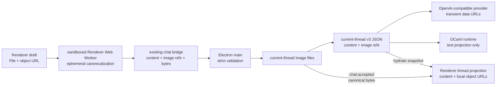

# Experiment 01：上下文 Composer 技术方案

> Status: Blocked after v1.8 evidence — E0/E0B STOP, user decision required
>
> Plan ID: `context-composer-exp-01`
>
> 这是失败的 v1.8 历史候选与证据记录，不是当前实现方案或 scope 授权。
> Worker/JPEG/allowlist、全部容量数值以及 E1-E5 的切片和文件清单均不
> 生效，也不构成实现许可。新的用户批准门禁可以改变输入类型、
> canonicalization 执行者、metadata policy、容量与切片/文件细节。
>
> 当前只有三条生效约束：E1-E5 blocked；未来方案仍由 Electron main
> 权威验证并持有 durable state；不得开始产品实现或扩大 scope。没有冻结
> 任何容量限制；状态以
> [runthrough 候选表](./context-composer-experiment-runthrough.md#historical-v18-candidate-limits-status-reference)
> 为准。
>
> E0B 观察仅限 Electron 41.7.2 / Chromium 146.0.7680.216 / macOS 26.6.1
> arm64 与已记录的 synthetic fixtures：OS-temp production-shape Vite
> Worker harness 的静态 Worker 在 dev、build、`app.asar` 加载，但 synthetic
> JPEG 输出 ICC APP2，触发 v1.8 候选 allowlist 的拒绝条件。

## v1.8 历史候选摘要（非生效方案）

v1.8 曾提议一个纵向闭环：**PNG/JPEG 图片通过粘贴、拖放或选择进入 Composer，由 sandboxed Renderer 的一个原生 Web Worker 做临时 canonicalization，再作为 `userContent` 旁边的一组有序 `imageRefs` 被 Electron main 权威验证并持久化，随后映射为 OpenAI-compatible Chat Completions 图片输入；assistant 输出、Provider resolver、Connections 和 OCaml 协议全部保持现状。**

该候选不是“上传系统”的第一版，也不为未来搭 Asset 平台。它拟增加当前单线程聊天的图片文件目录、引用关系和生命周期，但已经失败且不生效。

## v1.8 历史候选边界（非生效策略）

| 问题          | 历史候选                                                                                                                      |
| ------------- | ----------------------------------------------------------------------------------------------------------------------------- |
| 第一轮输入    | 文字、PNG、JPEG；支持 text-only、image-only、text + images                                                                    |
| 进入方式      | 原生 file input、系统粘贴、拖放                                                                                               |
| 内容模型      | user message 保留 `userContent`，只增加有序 `imageRefs`；assistant 仍是单段文字                                               |
| 图片转换      | Renderer 内一个 sandboxed Web Worker 使用 `createImageBitmap + OffscreenCanvas`；不接触文件系统、Provider 或 durable state    |
| 图片存储      | Electron main 管理当前 thread 的一个图片目录；JSON 只存引用，不存 Base64                                                      |
| Provider 传输 | main 在请求前读取去 metadata 后的 canonical 图片并临时转成 data URL；只在含图 user message 上使用 content array               |
| 发送确认      | main 落盘 user turn 与图片后发出 `chat:accepted`，返回 canonical bytes，并提交本次 target selection；确认前 Composer 不清空   |
| 能力判断      | 现有 target 没有可信能力数据，一律按 `unknown` 诚实尝试；不猜模型名，不新增 capability registry                               |
| 失败恢复      | 图片请求被目标拒绝时保留 durable user turn，允许切换 target 后 Retry                                                          |
| Runtime       | OCaml 只接收用户文字投影；image-only 投影为空字符串，不传图片或引用                                                           |
| 回滚          | 一旦写入 v3，回退版本必须保留 reader、图片读取/展示、历史 Provider 重建、Retry 与缺图 fail-closed；不承诺旧 binary 读取新记录 |

## v1.8 历史候选的目标与完成标准

该候选只验证一个体验问题：图片能否像文字一样自然地成为本轮上下文，而不引入模式切换和数据焦虑。

完成时必须同时成立：

1. 用户可以粘贴截图、拖入图片或打开系统选择器。
2. Composer 内可以预览和删除图片；没有文字也能发送。
3. 发送确认前发生任何校验或落盘失败，文字和图片仍留在 Composer。
4. 发送确认后，用户消息中的图片与文字在当前会话和应用重启后都可读。
5. 至少一个真实 OpenAI-compatible 多模态 target 能收到正确图片并返回现有文字流。
6. Unknown target 拒绝图片后，用户可以切换 target 并 Retry，同一图片不重复导入。
7. Stop、Retry、restart、New thread、target attribution 与 text-only 请求行为不回退。
8. Provider 收到的是去除 EXIF/文本块等 metadata 后的 canonical 像素内容，不会附带用户不可见的位置、设备或拍摄信息。

## 明确不做

- PDF、Word、文本附件、音频、视频、HEIC、SVG、GIF、WebP。
- 图片压缩设置、裁剪、标注、OCR、圈选、拖动排序。
- 富文本编辑器或 `contenteditable` Composer。
- assistant 图片输出、typed rich stream、Artifact、HTML 渲染。
- 通用 Asset entity、数据库、哈希去重、引用计数、云上传、跨 thread 共享。
- Provider adapter registry、Connections schema 迁移、手工 capability 配置、模型名推断。
- 新 IPC namespace、自定义文件协议、新 OCaml action 或 Electron ↔ OCaml 消息。
- 为暂不存在的多窗口或多线程历史做同步与 GC 设计。

一旦真实 target 只接受“先上传文件，再传 URL/file id”，立即停止本实验，不把远程上传偷偷塞进这一轮。

## 证据边界

### 仓库事实

- Renderer 当前在主进程持久化前就清空输入并乐观插入消息；`startChat` IPC 自身不会等待持久化完成。[`chat-reducer.ts`](../../apps/desktop/src/ui/chat/chat-reducer.ts) [`session.ts`](../../apps/desktop/electron/main/chat/session.ts)
- current-thread v2 只接受非空 `userContent` 字符串，无法表达 image-only；store 已具备严格 schema、原子 JSON 写入、稳定 turn identity 与懒迁移模式。[`schemas.ts`](../../apps/desktop/electron/main/current-thread/schemas.ts) [`store.ts`](../../apps/desktop/electron/main/current-thread/store.ts)
- Provider 请求映射集中在一个纯函数边界，text-only body 已有精确回归测试。[`client.ts`](../../apps/desktop/electron/main/chat/client.ts)
- target catalog 和 resolved target 都没有 capability；现有方向也禁止按 hostname 或 model name 猜能力。[`provider-adapter-direction.md`](provider-adapter-direction.md)
- OCaml runtime 是可重建的文字状态投影，Provider context 的真实来源仍是 Electron main 的 durable record。[`runtime-protocol.md`](../architecture/runtime-protocol.md)

### 外部事实

- Electron IPC 使用 Structured Clone，不能把 DOM `File` 或 `ImageBitmap` 直接发给 main；Renderer 必须先转成可序列化字节。[Electron ipcRenderer](https://www.electronjs.org/docs/latest/api/ipc-renderer)
- Electron `nativeImage.createFromBuffer` 可以在 main 同步解码 PNG/JPEG，用于 canonical bytes 的独立可解码性与尺寸交叉校验；E0 已证明不能再把高熵 PNG 的同步重编码放在 main。[Electron nativeImage](https://www.electronjs.org/docs/latest/api/native-image)
- Sandboxed Renderer 保持普通 Chromium 能力；Web Worker 可用 `createImageBitmap` 解码并按 EXIF orientation 定向，`OffscreenCanvas.convertToBlob` 可在 Worker 内输出 PNG/JPEG。Vite 原生支持 `new Worker(new URL(..., import.meta.url))` 的独立 chunk 构建。[Electron sandbox](https://www.electronjs.org/docs/latest/tutorial/sandbox) [Worker createImageBitmap](https://developer.mozilla.org/en-US/docs/Web/API/WorkerGlobalScope/createImageBitmap) [OffscreenCanvas convertToBlob](https://developer.mozilla.org/en-US/docs/Web/API/OffscreenCanvas/convertToBlob) [Vite Web Workers](https://vite.dev/guide/features.html#web-workers)
- OpenAI 官方确认 `/v1/chat/completions` 可接收图片输入，但这不证明任意 OpenAI-compatible target 或任意 model 都支持同一形状，所以真实 target fixture 与 runthrough 仍是放行条件。[OpenAI data controls](https://developers.openai.com/api/docs/guides/your-data#image-and-file-inputs)

## v1.8 候选中的权威边界



- Renderer 拥有未发送草稿、预览 URL、粘贴/拖放交互和可重建的消息投影；一个无 Node 能力的 Worker 只执行当前草稿的临时像素转换。
- Electron main 拥有接受策略、canonical bytes 权威验证、metadata 缺失验证、文件 IO、durable current thread、target 解析、Provider 请求和错误净化。Worker 输出未通过 main 验证前没有可信身份。
- Provider 只看到请求时生成的 data URL，不看到本地路径或 Nyx image id。
- OCaml 继续只拥有文字聊天状态，不成为图片存储或 Provider context 的来源。

## v1.8 候选的最小内容模型

首轮 Composer 的真实顺序只有“文字在前、图片按加入顺序在后”，所以保留现有 `userContent`，只增加 `imageRefs`。等产品真的允许文字与不同内容任意交错时，再为那个已出现的行为迁移到 parts；本轮不预先设计文件、音频、工具或 Artifact union。

| 语义              | 最小字段                                    | 约束                                                                   |
| ----------------- | ------------------------------------------- | ---------------------------------------------------------------------- |
| user content      | `content: string`                           | 保持当前 trim；v3 仅在至少一张图存在时允许空字符串                     |
| image ref         | `imageId`, `mediaType`                      | 按加入顺序；request、record 与 snapshot 共用；MIME 仅 PNG/JPEG         |
| new image payload | `imageId`, `bytes: Uint8Array`              | Worker canonical bytes；只随 `new_user_message` 发送；与 refs 一一对应 |
| accepted image    | `imageId`, `mediaType`, `bytes: Uint8Array` | 只返回本轮刚写入的 canonical bytes；顺序与 refs 一致；Retry 固定为空   |

规则：

- `content.trim()` 非空或 `imageRefs` 非空，两者不能同时为空。
- 每轮最多 4 张图片；Retry 不携带 `new image payload`，只引用 durable image id。
- `imageId` 在同一 current thread 中只允许出现一次；Retry 更新原 turn，不追加第二份引用。
- Draft 只有 renderer-local key，并记录 `preparing | ready | failed`；`imageId`、user message id 和 assistant message id 在每次 Send 尝试时生成，只有 accepted 后才成为稳定身份。
- system 与 assistant message 继续保存字符串 `content`。
- assistant stream 的 `start/delta/done/error` 形状保持不变，只增加一个发送生命周期事件 `chat:accepted`。
- text-only user message 在 Provider wire 上继续使用字符串 `content`，保证现有 body 逐字兼容。

`chat:accepted` 的最小字段固定为 `type`、`requestId`、`userMessageId`、`assistantMessageId`、`turnIntent` 与 `acceptedImages`。Main 不回显 `content`、`imageRefs` 或 target：它们在严格校验后不会被规范化，Renderer 继续使用本次 active turn 被锁定的提交值；`acceptedImages` 只包含本轮已写入文件的 canonical bytes，顺序与 `imageRefs` 一致，供当前消息立即建立与 Provider、重启 snapshot 完全相同的预览。Retry 的 `acceptedImages` 固定为空。事件不携带 Provider 信息或通用 transaction metadata。

Main 对既有 history 比较完整 `content + imageRefs`；对本轮新消息比较文字、
image id、声明 MIME 与 canonical payload 对应关系。Canonical 字节数和
thread 总量是 main 从 `Uint8Array` 或实际文件 `stat` 得出的存储事实，
不进入 message identity，也不接受 Renderer 声明。原始 draft 字节数不跨
bridge，只是 Renderer 的体验限制。

不增加 `partId`、通用 metadata、display name 或原文件名。图片本身已有稳定 `imageId`；其他字段等出现真实用途再加。

## v1.8 候选的输入限制与权威验证

E0 的 25 MP 常量已被高熵 fixture 否决。下面仅记录 v1.8 当时准备验证的
历史候选值；E0B 已停止，没有任何容量限制被冻结，状态以
[runthrough 候选表](./context-composer-experiment-runthrough.md#historical-v18-candidate-limits-status-reference)
为准：

| 限制                  | 数值                      |
| --------------------- | ------------------------- |
| 类型                  | `image/png`, `image/jpeg` |
| 每轮张数              | 4                         |
| Renderer draft 源文件 | 8 MiB                     |
| 单张 canonical 文件   | 8 MiB                     |
| 每轮新增图片总量      | 16 MiB                    |
| 当前 thread 图片总量  | 32 MiB                    |
| 当前 thread 图片总数  | 未冻结                    |
| 当前 thread 累计像素  | 未冻结                    |
| 单边像素              | 8192                      |
| 单张总像素            | 8,294,400（3840×2160）    |

draft 源文件限制只是 Renderer 的早期反馈；main 不接收也不信任原文件大小。
canonical bytes、尺寸、MIME、metadata、单轮与 thread 预算全部由 main
权威计算。

32 MiB compressed bytes 不能约束 object URL 解码后的历史图片内存。
v1.8 曾要求 E0B 再验证 current-thread 图片总数和累计像素上限，但 Stop
前未完成；这些值以及表中所有其他容量值都没有冻结。

v1.8 历史候选的处理顺序为：

1. Renderer 拒绝空文件、非 PNG/JPEG 声明、超过 8 MiB 的 draft，并在
   Worker 解码前用同一个纯 `image-file` parser 检查 magic、header、单边
   与总像素；通过后才把 owned `ArrayBuffer` transfer 给唯一 Worker。
2. Worker 用 `createImageBitmap(..., { imageOrientation: 'from-image' })`
   解码，按解码后的方向与尺寸画进同尺寸 `OffscreenCanvas`；不 resize。
3. Worker 以相同 MIME 输出；PNG 使用 `image/png`，JPEG 使用
   `image/jpeg`、quality 0.95。返回 Blob MIME 必须等于请求 MIME，随后把
   canonical `ArrayBuffer` transfer 回 Renderer。
4. Renderer 只把 canonical `Uint8Array` 放进现有 chat request；原始
   `File` 与 Worker 中间态仍是未发送草稿，不跨 typed bridge。
5. Main 对 request 与每个 nested object 严格拒绝额外字段；`imageId` 必须
   是 UUID，payload 与本轮 `imageRefs` 必须同序、一一对应且不重复。
6. Main 把 canonical payload 当作不可信输入：再次调用同一个无状态
   `image-file` parser 检查非空、8 MiB、PNG/JPEG magic、PNG IHDR 或
   JPEG SOF；截断、越界、无 SOF、单边或总像素超限立即拒绝。共用的是纯
   规则代码，不是 Renderer 的校验结果。
7. Main 用 `nativeImage.createFromBuffer` 做独立解码，交叉校验 MIME、
   header 与解码尺寸；这里不再调用 `toPNG` / `toJPEG`。
8. Main 用受限 parser 拒绝 metadata-bearing 结构：PNG 只允许 E0B fixture
   证明必要的视觉 chunk，明确拒绝 text/EXIF 类 chunk；JPEG 拒绝
   APP1-APP15、COM 以及任意、重复或扩展 APP0。只有 production Worker
   fixture 证明必需时，才可 allowlist 最多一个精确的最小 JFIF
   APP0 形状，不含 thumbnail 或任意 payload。parser 不能尝试保留或
   解释原 metadata。
9. 新图片不能覆盖已有 id；thread 总量只统计已知 record 的唯一 refs 对应
   文件 `stat.size`，再加本轮 canonical bytes。缺图、重复 ref、异常文件
   或无法读取时 fail closed；目录孤儿不参与预算。
10. 任一项失败时，不写图片、不写 record、不启动 Runtime、不解析 target、
    不调用 Provider。

Worker 不拥有安全结论：main 的 decoder、header parser 和 metadata
allowlist 才是接受边界。E0B 必须用 EXIF orientation、GPS/device、XMP、
JPEG COM、自定义/重复/扩展 APP0、PNG text/eXIf fixtures 证明画面方向正确且 canonical bytes
不再包含原 metadata；证明不了就停止。Composer 不增加确认弹窗；
canonical 超限或验证失败时保留草稿并显示安全错误。

## Durable commit 与 `chat:accepted`

### 新消息

1. 图片加入 draft 时，Renderer 立即把它标为 `preparing` 并交给唯一的
   image Worker；UI 主线程继续响应。Worker 成功后 draft 变为 `ready` 并
   只持有 canonical bytes；失败则保留可见错误，不能 Send。
2. Renderer 捕获当前文字、全部 ready 图片与 target，为本次尝试生成
   request/user/assistant/image IDs，进入短暂的 `accepting` 状态；Composer
   内容可见但锁定，不能被第二次 Send 修改。
3. Renderer 通过现有 `startChat` bridge 发送 `content`、`imageRefs` 与
   本轮 canonical image payload；原始 `File` 不跨 bridge。
4. Main 严格解析并权威验证全部 canonical 图片，图片之间显式 yield。
5. Main 把每张 canonical 图片写入临时文件，再原子 rename 到最终文件。
6. Main 写入引用这些图片的 pending record；首个含图 turn 才使用 v3，纯文字继续沿用既有版本规则。
7. 只有第 6 步成功后，durable prepare 才把结果返回 `ChatSessionManager`；manager 再次确认 `activeSession === session` 且 sender 存活，才发出带本轮 canonical bytes 的 `chat:accepted`。Coordinator、store 和图片 helper 都不能自行发事件。
8. Renderer 收到 accepted 后，撤销 draft URLs，用 accepted canonical bytes 为 sent message 建立新 URLs，把捕获的 `content + imageRefs` 移入 thread，并把本次 active turn 的 target selection 写成 `committedTarget`；随后才清空对应 Composer 内容并允许起草下一轮。
9. Main 随后解析 target、持久化 attribution、提交文字投影给 Runtime，再调用 Provider。

### Retry

1. Retry 保持 user/assistant/image IDs，只生成新的 request ID，并采用当前 Composer target draft。
2. Main 先把 durable failed turn 转回 pending，再发 `chat:accepted`；不复制图片文件。
3. accepted 前 Renderer 保留原错误；accepted 后才把 assistant message 改回 pending。

### 失败分界

- **accepted 前失败：** Composer 原内容不动；不出现假的 user message；错误显示在 Composer 附近。
- **accepted 后、terminal write 成功：** user message 已 durable，main 先把安全错误写成 terminal failure，再通知 Renderer；只有此时才承诺立即 Retry。
- target resolve 失败继续使用现有 `target_unavailable` settlement。target attribution 写失败时，按下文的本地 write contract 可确定 binding 未提交：不启动 Runtime/Provider，也不再尝试专用 terminal transition；Renderer 只显示安全、非 Retry 的“保存失败，请重启恢复”。磁盘中的 unbound pending turn 由既有 restart recovery 转成 retryable interrupted failure。
- 图片文件成功但 record 写失败时，main 尽力删除本次新文件；若清理也失败，草稿仍保留，但下一次 Send 生成全新的 IDs，因此不会被旧孤儿永久卡住。
- `chat:accepted` 继承下述本地 adapter contract：覆盖应用进程失败与正常重启，不声称抵抗断电或 OS/filesystem 崩溃。若未来要承诺 power-loss durability，再按 image file → asset directory → record file → thread directory 的顺序增加 sync；本轮不引入 transaction abstraction。

这一个事件解决真实的数据所有权切换，不扩展成通用 transaction/event 框架。

### accepting 期间 Stop / New thread

- Durable prepare 接收本次 session 的 `AbortSignal`，在每张图片之间、写文件前和写 record 前检查；Stop 在 record commit 前生效时，清理本轮临时内容、保留 Composer 草稿且不发 accepted。Manager 对仍 active 的 session 复用现有 `chat:error` 发出安全、非 Retry 的 `cancelled`；Renderer 把它当作 pre-accepted attempt 终止，只解锁 Composer，不插入消息、不清草稿、不改 `committedTarget`。若 New thread 已让 session 失效，则抑制该事件。
- Stop 与 record commit 竞速时，以 commit 结果为边界：若 pending record 已成功写入，manager 先发 accepted，再把尚未绑定的 pending turn 持久化为 `cancelled`；不解析 target，不启动 Runtime/Provider。Store 只为这条 accepted-after-Stop 路径允许 unbound cancelled settlement。
- New thread 先让 active session 失效并 abort，再等待旧 operation 结束；因此迟到的 prepare 结果过不了 manager 的 active-session check，不会发 accepted。随后才按既有顺序 reset record 和图片目录。
- accepted、cancel/error 与 reset 的测试都使用 request/session identity；迟到事件不得重新插入已清空消息或创建无人拥有的 object URL。

## current-thread v3 与图片文件

### Record

- v3 保留每个 turn 的 `userContent`，只增加有序 `imageRefs`；`userContent` 仅在 `imageRefs` 非空时允许空字符串，其余 assistant content、status、safe error、target binding 和 ID 语义保持不变。
- image refs 属于 user turn 的稳定身份；terminal transition、Retry 与后续 append 都不能改写。
- v1/v2 稳定 record 继续原样读取，不因 hydration 被重写。
- 既有兼容行为保持：v1 在下一次真实文字 mutation 或 pending recovery 时升级为 v2；v2 的文字发送、Retry、terminal transition 与 pending recovery 继续保持 v2。
- 只有第一次成功接受含图的新 user turn 时，才把当前 v1/v2 完整记录升级为 v3：旧 `userContent` 保持原值并补空 `imageRefs`，再追加含图的新 turn。写过 v3 后，后续文字 turn 继续使用 v3，并写空 `imageRefs`。
- 未知 future version 或 malformed record 继续 fail closed，不覆写，也不触发图片清理。

### 本地 atomic write contract

- current-thread 与图片 helper 的最终提交操作都是本地文件系统 `rename(temp, final)`；`rename` resolve 才算提交，reject 就表示 final path 未改变。本轮不支持远程、网络或自定义存储 adapter。
- `writeAtomic` 在 final rename 后不执行任何可能失败的操作，Store 也只在 rename resolve 后更新内存缓存。测试 adapter 只能在调用真实 rename 前注入失败，禁止“先 rename 再抛错”这种违反契约的假故障。
- create、append、Retry pending、target bind 和 terminal settlement 共用这一个结果语义；因此 rejected write 可以安全使用旧缓存继续判断，resolved pending write 才允许 manager 发 `chat:accepted`。
- Durable prepare 必须在 record write 前完成 schema、history、canonical bytes 与返回对象的构造；record rename resolve 后到 manager 接收 prepared result 之间不得再做 I/O、解析或其他可能失败的工作。
- 应用进程若在 rename resolve 后、Renderer 收到 accepted 前退出，下一次启动从磁盘恢复 pending；这仍属于本文已声明的 app-process crash 边界，不是同进程的模糊结果。
- 未来若增加 fsync、post-rename chmod、网络文件系统或可在提交后报错的 adapter，必须停止并为所有写路径统一重做 commit/recovery 模型；本轮不保留 fresh reload、第二个 Store 或 transaction manager。

### Files

- 路径固定为 `userData/threads/current-thread-assets/<imageId>`；record 永远不保存绝对路径。
- 目录 mode 为 `0700`，图片 mode 为 `0600`；不记录原文件名。
- 沿用现有临时文件 + rename 模式，不新增 store interface、数据库或 transaction abstraction；“durable”在本文中特指现有应用进程崩溃边界。
- Provider 与 hydration 共用一个 main-only bounded read：先拒绝 symlink、非普通文件、空文件和超限文件，再按受限大小读取并复查实际长度、magic、header 与持久化 MIME。Provider 遇到任一 unavailable ref 就安全失败，不能静默省略；hydration 则为该 ref 返回 unavailable 描述并继续加载其余内容。本轮不增加哈希或完整 bit-rot 检测。

### Hydration

- 扩展现有 current-thread snapshot，在独立的 bounded image payload 列表中携带 record 所引用的 `Uint8Array`；不新增 read-asset IPC。
- Message 只保存 `content`、image id 与安全描述；Renderer 从 snapshot bytes 建立 object URL。
- 单个文件缺失时仍加载 thread 文字和其他图片，并把该位置显示为“图片不可用”；Retry/继续对话若需要这张历史图片则 fail closed。

### Reconcile 与 New thread

- 只有 record 成功解析为已知版本时，启动 reconcile 才能删除目录中未被引用的孤儿。
- record 不存在时可以删除整个 current-thread-assets 目录。
- New thread 必须先成功删除/reset record，再删除图片目录；目录删除失败只留下不可达文件，下次确认 record 不存在后重试。
- record reset 失败时，旧 record 与全部图片必须保持可恢复，不能先删文件。

## Provider 映射与错误语义

Provider adapter 仍只有当前 OpenAI-compatible Chat Completions 路径：

- text-only user：保持 `{ role: 'user', content: '...' }`。
- 含图 user：按固定的 text-first 顺序映射成 content array，再按 `imageRefs` 顺序追加 image；image 使用 main 刚读取的 `data:<mime>;base64,...`。
- image-only user：只发送 image content entries，不制造假文字。
- system/assistant：保持字符串 content。
- request body、日志、snapshot 和 renderer error details 都不能出现本地路径；Provider 原始错误不得把 data URL/Base64 回显到 UI 或磁盘。

能力策略：

- 当前所有 target 都是 `unknown`，允许尝试。
- 不从 provider id、base URL、model id 或一次 400 反推并缓存 `unsupported`。
- image-bearing 请求收到 400/413/415 时，映射为新的安全、可 Retry 的 `content_rejected`；文案只说明“所选目标拒绝了这次图片请求”，提示可切换 target。
- text-only 400 继续沿用现有非 Retry 的 `invalid_request`，不改变旧行为。
- `content_rejected` 必须先写入 durable assistant failure，再发 Renderer error event；snapshot/restart 后仍保持可 Retry。
- 所有 image-bearing HTTP error path 都使用固定安全文案并丢弃 upstream body/details；400/413/415 之外仍沿用既有错误类别，但同样不能回显 data URL。
- 未来只有 main 获得权威 capability 数据后，`known unsupported` 才能在 accepted 前阻止发送并保留草稿；这不属于本实验。

## Renderer 体验

### Composer

- 保留原生 `textarea`，在上方增加紧凑的图片预览 shelf；不换编辑器。
- 一个带可访问名称的按钮触发隐藏的原生 `<input type="file" accept="image/png,image/jpeg" multiple>`。
- Paste 只接管 clipboard 中的图片项；普通文字粘贴行为不变。
- Drop 只在确实包含受支持图片时接管并阻止浏览器导航；普通文本拖放不被吞掉。
- 每张图显示稳定缩略图、序号与明确的移除按钮；顺序按加入时间，不支持拖动排序。
- Send 条件从“非空文字”改成“文字或至少一张有效图片”。Enter/Shift+Enter 与 IME 行为保持现状。
- 读取、拒绝、超限和 accepted 前失败通过 `aria-live` 简短反馈；拖放不是唯一入口。
- 新消息和 Retry 发起时只捕获 target selection，不更新 `committedTarget`；accepted 后才提交。accepted 前失败保留旧 committed target，当前选择仍只是 Composer draft。

### Thread

- user message 固定显示文字在前、图片网格在后；点击图片使用原生 `<dialog>` 做大图预览。
- image-only 的 thread title/preview 使用稳定文案 `Image`，不显示空白或旧的 New thread fallback。
- 缺失图片显示固定占位，不让整个 thread 崩溃。
- assistant message、streaming indicator、Retry 与 target attribution 保持当前样式和行为。

### Object URL 所有权

- draft 为原始 `File` 创建 object URL；remove、拒绝、reset、unmount 必须 revoke。
- accepted 后撤销原始 draft URL，并从 `acceptedImages` 的 canonical bytes 创建 sent message URL；不能把原始 URL 直接转给消息。
- hydration 用 snapshot bytes 新建 URL；projection generation 变化或迟到异步结果必须 revoke。
- 用一个 renderer-local 小 helper 管生命周期，不建全局 image cache。

## Runtime 投影

- 新消息与 replay 直接投影 `userContent`；image-only 传空字符串。
- 不传 marker、本地路径、image id、MIME 或 Base64。
- Provider messages 不从 Runtime 反推；main durable record 仍是唯一上下文来源。
- 增加 image-only 的 default-on runtime send/fail/retry/restart/New thread 回归检查，但不修改 OCaml 类型与 NDJSON 协议。

## 实现切片

本节完整保留失败的 v1.8 历史切片，便于审计。T1-T5 的 owner、文件清单、
完成条件和验证项均不生效，不构成实现许可；对应 E1-E5 仍 blocked。新的
用户批准门禁可以改变任何切片或文件细节。

### T0A — 原同步 main gate（STOP）

真实 target、4 图普通 fixture、32 MiB hydration 与 32 MiB 历史请求构建
通过。最初的 25 MP fixture 只有 0.7 MiB → 0.1 MiB，不能代表 byte
上限；补测后：

- 25 MP / 7.78 MiB 高熵 PNG：main 同步 encode 1014 ms。
- 最低 8 MP / 7.67 MiB 高熵 PNG：main 同步 encode 1046 ms。

两者都违反 250 ms 止损线，因此 synchronous main canonicalization 被
否决。T0A 不授权 T1-T5。

### T0B — Native off-main canonicalization feasibility（STOP）

**当时的唯一候选（现已失败）**

- 复用当前 sandboxed Renderer，只增加一个普通 Web Worker。
- Worker 使用 `createImageBitmap + OffscreenCanvas` 做同 MIME、同尺寸
  canonicalization；不启用 Node，不接触文件系统、bridge、Provider 或
  durable state。
- Main 不再同步重编码，只做 header、magic、`nativeImage` decode、
  metadata allowlist、预算与 identity 的权威验证。
- 不增加 dependency、`utilityProcess`、worker pool、第二 bridge、图片
  service 或 product code abstraction。

**已有候选证据**

- 8 MP / 7.67 MiB PNG：Worker 282 ms，Renderer 最大 heartbeat gap 12 ms，
  main validation 38 ms，app working-set +173.8 MiB。
- 3840×2160 / 7.53 MiB PNG：Worker 218 ms，heartbeat gap 12 ms，main
  validation 37 ms，app working-set +175.7 MiB。
- 25 MP 输出 8.19 MiB 且 working-set +371.5 MiB，明确不保留。
- 在已记录环境中，OS-temp production-shape Vite Worker harness 的静态
  Worker 已在 dev、build、`app.asar` 加载；这不是 production Renderer
  integration。

**Stop 时尚未完成**

- 用普通 Retina 截图、4 张日常图、3840×2160 高熵 PNG、JPEG quality 0.95、
  EXIF orientation、GPS/device/XMP/COM、自定义/重复/扩展 APP0、PNG
  text/eXIf fixtures 验证方向、视觉、MIME、canonical 上限和
  metadata allowlist。
- 覆盖 remove/New thread/unmount 时的 stale result 丢弃、Worker termination、
  transferable buffer 失效，以及 error/timeout 后 draft 可恢复。
- 测量 Renderer heartbeat、main 单段 validation、单图/4 图总时间与
  main+Renderer+Worker peak working set；不得只取完成后的 RSS。
- 在 OS-temp harness 内，按候选 count/pixel 用多张高压缩比、
  满像素的 canonical 图片生成 object URLs 和真实 ``，挂入
  可见 DOM grid；等待 `img.decode()` 或 load/error 终态后，记录
  main+Renderer+Worker 全进程 peak working set。这个 harness 不导入
  production Renderer components，也不要求实现或运行仍被 E4 阻塞的
  `ChatMessage`/product message grid；32 MiB typed-array 接收时间不能
  代替这条证据。据此冻结 thread 图片总数与累计像素，不预设数字。
- 审查证据保留执行过的脱敏命令形状（不含绝对路径/私密数据）、确定性
  seed 与 fixture hash、重复次数、peak 采样方法和 packaged Worker 加载
  证据。Sanitized harness/fixtures 只可留在 OS temp 供本轮独立审查，审查
  后已删除；现存命令形状不是自包含复现。不得提交 probe code。

**放行/Stop**

- Renderer 主线程 heartbeat gap ≤50 ms；main 任一同步 validation 段
  ≤250 ms；4 张日常图全部 ready ≤1.5 s；3840×2160 高熵单图 ready ≤1 s；
  peak working-set 增量 ≤192 MiB。
- source 与 canonical 各 ≤8 MiB，canonical pixels ≤8,294,400；最终常量
  仍满足 4 张/turn、16 MiB/turn 与 32 MiB/thread，并从 visible-DOM
  harness 证据冻结
  thread 图片总数与累计像素。
- JPEG 输出 MIME fallback、orientation 错误、metadata 无法 fail closed、
  production Worker 无法加载、UI/main 超线或 peak memory 超线时停止。
- 如果找不到无 thumbnail/lazy-load 也能满足 peak memory 的实用 thread
  图片总数与累计像素上限，停止并要求新的方向决策。
- Stop 后不得自动加入 dependency、`utilityProcess`、放宽体验线或开始
  T1-T5；这些都需要新的方向决策。

### T1 — Image refs 与 current-thread v3

**主要 owner**

- `apps/desktop/shared/chat/types.ts`
- `apps/desktop/shared/chat/snapshot.ts`
- `apps/desktop/electron/main/current-thread/schemas.ts`
- `apps/desktop/electron/main/current-thread/store.ts`
- `apps/desktop/electron/main/current-thread/session-coordinator.ts`
- `apps/desktop/electron/main/current-thread/snapshot.ts`

**完成条件**

- text-only 全链路仍通过；v1/v2 read 不改字节，v1 文字 mutation/recovery 仍只到 v2，v2 文字 mutation/recovery 仍是 v2，首次含图 mutation 才升级 v3，v3 文字 mutation 保持 v3。
- text、image-only、text+images、text-first image 顺序、全 thread 唯一 image id、稳定 identity、Retry 和 unknown-version fixtures 齐全。
- v3 JSON 只含图片 refs，没有 bytes、路径或 data URL。
- Coordinator 在 T1 只负责 v3 identity、迁移和文字 history 校验；不预埋
  图片导入、bounded file read、Provider mapping 或 `content_rejected`。

### T2 — Main 图片导入与 durable acceptance

**主要 owner**

- `apps/desktop/electron/main/chat/session.ts`
- `apps/desktop/electron/main/index.ts`
- `apps/desktop/electron/main/current-thread/store.ts` 及既有 file adapter
- `apps/desktop/electron/main/current-thread/session-coordinator.ts`
- `apps/desktop/electron/main/current-thread/snapshot.ts`
- `apps/desktop/electron/main/current-thread/` 下一个直接的图片文件 helper
- `apps/desktop/shared/chat/image-file.ts` 下一个 main/Renderer 共用的纯
  header 与 metadata parser
- `apps/desktop/shared/chat/events.ts`

**完成条件**

- 严格 request/image validator、解码前 header 限额、magic/decode 交叉校验、
  PNG/JPEG metadata allowlist 和文件 mode 测试通过；main 不同步重编码。
- Main composition 用 `userData` 组装唯一 current-thread 图片 owner，同一
  helper 供 session prepare/reset/reconcile 和 snapshot bounded reads 使用。
- Coordinator 完成含图新消息的 prepare、Retry、reset 与 orphan reconcile；
  snapshot service 通过同一 bounded read 返回可用 bytes 或 unavailable 描述。
- 文件写失败、rename 失败、record 写失败都不会启动 Runtime/Provider，也不会生成坏引用。
- record write 与 cleanup 同时失败后，同一 draft 使用新 IDs 可以再次发送；旧孤儿只在安全 reconcile 时删除。
- `chat:accepted` 严格发生在 pending durable 之后、target 解析之前；新消息返回的 bytes 与磁盘 canonical 文件逐字节相同，Retry 返回空 `acceptedImages`。
- file adapter contract test 固定“rename reject 不改变 final path，resolve 后不再有 fallible step”；create、append、Retry、bind 和 terminal write 都用同一断言，不增加 post-rename 模糊故障。
- target bind rename 失败后不启动 Runtime/Provider、不尝试专用 terminal transition，只发安全且非 Retry 的 restart-required 错误；重启后 pending recovery 才恢复 Retry。
- bounded read 覆盖缺失、symlink、目录、空文件、超限、截断、PNG/JPEG magic 与 persisted MIME 互换；Provider 和 hydration 不各写一套读取规则。

### T3 — Provider 与 Runtime 投影

**主要 owner**

- `apps/desktop/electron/main/chat/client.ts`
- `apps/desktop/electron/main/chat/session.ts`
- `apps/desktop/shared/chat/types.ts`
- `apps/desktop/electron/main/current-thread/schemas.ts`
- `apps/desktop/electron/main/current-thread/session-coordinator.ts`
- `apps/desktop/electron/main/current-thread/runtime-replay.ts`

**完成条件**

- text-only body 精确不变；text+image、image-only、多图顺序、多轮历史 fixture 正确。
- body 不含本地路径、image id、原文件名；错误不回显 Base64。
- `content_rejected` 只作用于 image-bearing 400/413/415；换 target Retry 使用原图。
- Shared chat error code、v3 safe-error schema/message 与 coordinator settlement 在本片
  一次加入 `content_rejected`；v1/v2 persisted schema 不改。
- OCaml 协议不改，runtime chat-state 集成覆盖 image-only 文字投影。

### T4 — Composer、消息展示与 hydration

**主要 owner**

- `apps/desktop/src/ui/chat/use-chat-session.ts`
- `apps/desktop/src/ui/chat/chat-reducer.ts`
- `apps/desktop/src/ui/chat/chat-types.ts`
- `apps/desktop/src/ui/chat/image-canonicalizer.worker.ts`
- `apps/desktop/src/ui/chat/components/ChatWorkspace.tsx`
- `apps/desktop/src/ui/chat/components/ChatComposer.tsx`
- `apps/desktop/src/ui/chat/components/ChatMessage.tsx`
- `apps/desktop/src/ui/chat/chat-presenters.ts`

**完成条件**

- picker、paste、drop 都归一到同一个 draft image path；一个 lazy Worker
  顺序处理 `preparing → ready | failed`，不引入 pool/manager abstraction。
- Worker 使用 Vite 的静态 `new Worker(new URL(...))` 形状；source/canonical
  buffer 都用 transfer，remove/New thread/unmount 后 stale result 被忽略且
  Worker/bitmap/object URL 全部释放。
- 含图 Send 只在所有 draft ready 后可用，bridge 接收 canonical bytes；
  Worker 错误留在对应 draft，不产生 request 或 main side effect。
- accepted 前失败保留草稿；accepted 后才插入消息和清空；当前消息 URL 必须来自 accepted canonical bytes，Retry accepted 前保留旧错误。
- 新消息与 Retry 都只在 accepted 后更新 `committedTarget`；accepted 前 parser/image/store 失败保持旧值，重启 snapshot 与当前投影一致。
- object URL 所有终止分支均有纯函数/注入式回归检查，不新增 DOM 测试库。
- v1.8 原计划让真实 product message grid 按 E0B 后续冻结的 thread 图片
  总数与累计像素上限回归；E0B 实际未冻结任何上限。
- image-only title、missing placeholder、键盘操作和原生 dialog runthrough 通过。

### T5 — 生命周期与完整验收

**完成条件**

- restart、interrupted pending、Stop、Retry、换 target Retry、New thread 与孤儿 reconcile 全部通过。
- accepting 中 Stop 覆盖 commit 前 `chat:error(cancelled)` 解锁，以及 commit 后 accepted→cancelled；record 写入中 New thread 不得收到迟到 accepted/error。
- 关闭/移除新图片入口后，v3 fixture 仍能 hydration、继续对话、Provider 重建与 Retry；缺图仍 fail closed。
- 一个真实 target 完成 text+image 与 image-only；若本机有第二个 target，再完成 reject/switch/retry 实测。
- v1.8 曾要求用 E0B 冻结的 thread 图片总数与累计像素上限验收真实
  product message grid；E0B 实际未冻结任何上限。
- 更新独立 runthrough 文档，记录真实差异和本轮未解决问题；不借验收扩大 scope。

## 风险到验证的对应关系

| 风险                  | 必须失败的注入点                                                         | 放行断言                                                                     |
| --------------------- | ------------------------------------------------------------------------ | ---------------------------------------------------------------------------- |
| Composer 丢草稿       | Worker error/timeout、parser、image write、image rename、record rename   | accepted 前草稿完整；无 Provider/Runtime side effect                         |
| record 引用缺图       | 图片成功后 record 失败；应用进程崩溃留下孤儿                             | 在既有 app-crash 保证内允许孤儿、不允许 committed 坏引用；下次安全 reconcile |
| 孤儿阻塞重发          | record write 与 cleanup 同时失败                                         | 草稿不丢；下一次 Send 使用新 IDs 并可成功                                    |
| 本地 write 契约漂移   | create/append/Retry/bind/terminal 的 rename 前失败与成功                 | reject 时 final/cache 不变；resolve 后没有 fallible post-step                |
| accepted 后 bind 失败 | target bind rename reject                                                | 无 Runtime/Provider/专用 terminal；安全提示重启，pending 由 restart recovery |
| target 提前提交       | new/retry accepted 前 parser、image、store 失败                          | `committedTarget` 保持旧值；accepted 后才等于 captured selection             |
| accepting 无法结束    | commit 前 Stop；record write 中 New thread                               | active session 收 cancelled error 解锁；失效 session 不发迟到 accepted/error |
| 路径或资源攻击        | `../` id、额外字段、MIME spoof、SVG、截断 header、无法解码、超限、空文件 | main 解码前先拒绝异常尺寸；磁盘无新 record/文件                              |
| 历史文件异常出站      | symlink、目录、截断、magic/MIME 互换、超限                               | hydration/Provider 共用 bounded read 并 fail closed                          |
| 隐藏 metadata 出站    | 带 EXIF/GPS/PNG text chunk 的 fixtures                                   | canonical 文件与 Provider body 不再含原 metadata；可见方向/像素验收通过      |
| Worker 阻塞或泄漏     | 4 图、remove、New thread、unmount、decode/encode error                   | UI heartbeat/main validation 达线；stale result/buffer/bitmap/Worker 全释放  |
| text-only 回退        | 现有 body fixture、stream fixture、target tests                          | body 与事件语义不变                                                          |
| Retry 丢图或复制图    | reject → switch → Retry；restart → Retry                                 | image id/文件稳定，request id 改变，只有一次文件                             |
| 历史缺图被静默忽略    | 手工删除一个 image file                                                  | thread 可读，图片占位；Provider 请求明确失败                                 |
| 错误泄漏图片          | upstream 回显 body/data URL/path                                         | UI、日志、JSON 均无原始错误与 Base64                                         |
| URL 泄漏              | remove、reject、accepted、reset、unmount、stale hydration                | 每个 URL 恰好 revoke 一次                                                    |
| 当前/重启图片不一致   | 带 metadata/orientation 的图片发送后立即查看并重启                       | 当前消息、磁盘、Provider body 与 hydration 均来自同一 canonical bytes        |
| main/hydration 卡顿   | Worker canonicalization、main validation、32 MiB snapshot/Base64/JSON    | UI/main/peak memory 达到 T0B 止损线；否则停止                                |
| 历史图解码内存失控    | OS-temp 可见 DOM grid 中高压缩比满像素图的 object URL 解码               | 候选要求冻结 thread 图片总数/累计像素且 peak 达线；Stop 前未完成             |
| schema 回退           | v1/v2 stable read、文字 mutation/recovery、首次含图 mutation、unknown v4 | stable read 不写；v1→v2 与首次含图→v3 边界准确；unknown 不写不 GC            |
| 功能回退破坏历史      | 去掉 Composer 新导入入口后加载 v3 fixture                                | hydrate、继续、历史 Provider 映射、Retry 仍正确；缺图 fail closed            |

## 自动验证

实现完成后至少运行：

```bash
mise run desktop:test
mise run desktop:typecheck
mise run desktop:typecheck:compat
mise run desktop:lint
mise run desktop:build
mise run runtime:chat-state:check
```

跨边界收尾再运行：

```bash
mise run desktop:check
mise run check
```

## 手工 runthrough

1. 普通 text-only 发送、流式、Stop、Retry 与当前行为一致。
2. 粘贴一张 macOS 截图，添加文字，删除，再重新粘贴发送。
3. 拖入 JPEG；拖入普通文本不被 Composer 错误拦截。
4. 选择 4 张图；第 5 张、超大图、伪装 MIME、SVG 均在 Composer 中清楚失败。
5. image-only 发送，user bubble 与 sidebar preview 正确。
6. text + 2 images 的顺序在 user bubble、durable record 与 Provider request 中一致；发送后立即显示与重启后的像素方向一致。
7. accepted 前注入 record 与 cleanup 双失败，草稿仍在；恢复后无需重新选择文件，并使用新 IDs 成功发送。
8. accepted 后注入 target bind rename 失败：binding 与 Provider 均未提交，只提示重启；重启把 pending 恢复为可 Retry failure。
9. 新消息与 Retry 在 accepted 前分别注入失败，`committedTarget` 保持旧值；accepted 后才更新。
10. accepting 中 Stop：commit 前收到安全 cancelled error 后解锁并保留草稿，commit 后先 accepted 再 cancelled；record write 中 New thread 不接收迟到 accepted/error。
11. Unknown target 返回 400，图片仍在 thread；切换 target 后 Retry 成功。
12. 发送中 Stop，重启应用，失败 turn 与图片仍可读且可 Retry。
13. New thread 清空视图与 record；图片目录删除失败时不恢复旧 thread，下次启动完成清理。
14. 手工造成一张历史图片缺失、截断和 MIME 互换：thread 其余内容可读，继续请求不会默默漏掉图片。
15. 只用键盘完成选择、预览、移除、发送与关闭 dialog；VoiceOver 能读出状态。
16. 导入带 GPS/设备 metadata 和 EXIF orientation 的 JPEG；发送后的 canonical 文件无 metadata，画面方向正确。
17. 暂时移除新图片入口后加载 v3 fixture，继续对话与 Retry 仍携带历史图片。

## Rollout、回滚与止损

- 这是个人本地应用，不建设 feature flag、灰度系统或 telemetry。
- 首次实现只在开发构建使用；自动检查与手工 runthrough 全过后再进入日常版本。
- v3 是 forward-only 数据。写入 v3 后，如需关闭新图片发送，只能移除 Composer ingress；必须保留 v3 reader、图片文件读取、snapshot hydration、展示、历史 Provider 映射、Retry、错误净化与缺图 fail-closed。不能完整回退到只认识 v2 或只会展示图片的 binary。
- 未知版本、损坏 record 或无法确认引用集合时禁止自动 GC。
- T0A 已证明同步 main 重编码在最低能力仍失败。T0B 只验证一个 native Web
  Worker；它不通过时停止，不自动加入 dependency、`utilityProcess`、缩略图、
  懒加载或 asset store。
- 若真实使用反复需要 PDF/文档、远程 file id、跨 thread 复用或 assistant 产物，再单独规划下一种内容，而不是扩展本实验。

## 被拒绝的替代方案

| 方案                                | 不采用的原因                                                                                                 |
| ----------------------------------- | ------------------------------------------------------------------------------------------------------------ |
| Base64 直接塞 current-thread JSON   | 每次 pending/bind/terminal 都重写整份图片；重启 IPC 与未来迁移成本被放大                                     |
| 首轮直接迁移到通用 parts union      | 当前只有 text-first + image list，没有任意交错；会无谓扩大 shared contract、迁移、snapshot 与 Runtime 投影   |
| 把 `File` 直接发 IPC                | Electron 官方明确不支持 DOM File 跨 IPC                                                                      |
| Renderer 直接读路径或 Provider 凭据 | 破坏现有 main ownership 与安全边界                                                                           |
| 模型名/域名推断 vision              | 仓库没有可信事实，兼容服务命名不可控                                                                         |
| 先建通用 Asset service/registry     | 当前只有一个 thread、一种文件类型、一个 owner；接口与注册表都没有第二个真实实现                              |
| 现在修改 OCaml 协议                 | Runtime 不是 Provider context owner，图片对当前状态机没有行为语义                                            |
| 发送原始 JPEG 或首次确认 metadata   | 原始文件会无感带出位置/设备信息，确认弹窗又打断核心路径；Worker transform + main metadata allowlist 才能放行 |
| `utilityProcess` + 图片 codec       | v1.8 当时先验证无依赖 Worker；该候选随后失败，本表不选择后续方向                                             |

## v1.8 历史最终门禁（已失败）

以下是 v1.8 当时的门禁。E0B Stop 后它不能满足，已不生效；开始任何实现需要
新的用户批准门禁，而不是继续完成此清单：

- E0B 使用 production Vite Worker、PNG/JPEG metadata/orientation、OS-temp
  可见 DOM grid 的 object-URL/`` decode 与 peak memory fixtures 完整通过，包括
  thread 图片总数和累计像素在内的最终常量按当时要求冻结；实际未冻结。
- E0B 的 sanitized OS-temp harness 已经过本轮独立审查并删除，
  runthrough 保留了执行过的脱敏命令形状、seed/hash、重复次数、peak 方法和
  packaged Worker 证据；harness 已删除，因此命令形状不是自包含复现。
- 当前版本与 fingerprint 已被 convergence reviewer 绑定并检查。
- 持久化、shared contract、ownership、迁移与错误语义没有未决 blocker。
- 独立 Linus Review 没有 critical/high 未解决 finding，也没有要求新增通用平台的 scope creep。
- 用户明确确认开始执行该 named slice。

## 决策记录

- 2026-08-07 / v0.1：选择窄 current-thread 图片目录而非 Base64 JSON 或通用 Asset 平台。
- 2026-08-07 / v0.1：增加 durable `chat:accepted`，解决 Composer 在主进程确认前丢内容的现有时序缺口。
- 2026-08-07 / v0.1：现有 targets 全部按 unknown 处理；不新增 capability schema，不做模型名推断。
- 2026-08-07 / v0.1：首轮只支持 PNG/JPEG，assistant stream 与 OCaml 协议不扩展。
- 2026-08-07 / v0.2：对抗检查后固定 accepted 事件的最小 payload、history/byteSize 权威校验、durable `content_rejected` 顺序，并把真实 target 证据移到 scope gate 之前。
- 2026-08-07 / v0.3：独立 gate 后补齐回退的完整历史/Retry 兼容面；改为解码前 header 限制与 nativeImage 同 MIME 重编码去 metadata；accepted 前失败重发改用新 IDs；durability 明确收窄到现有 app-process crash 保证。
- 2026-08-07 / v1.0：独立 reviewer 对 v0.3 的五项 revision contract 全部判定 resolved；无新 critical/high，方案冻结为 ready for handoff。
- 2026-08-07 / v1.1：新一轮严格复核撤销 ready：统一当前显示与持久化的 canonical bytes，移除 message identity 中的 `byteSize`，把 v3 升级推迟到首次含图 mutation，并增加同步图片处理与 hydration 的性能止损。
- 2026-08-08 / v1.2：接受 v1.1 full review 的四项局部 finding：首轮收缩为 `userContent + imageRefs`；闭合 accepted 后 target bind 双写失败；T0 加入完整历史 Base64/JSON probe；Provider/hydration 共用 bounded read。
- 2026-08-08 / v1.3：最终 full gate 证明普通 Store read 不能判断模糊写结果；增加 queued fresh-disk recovery，并把 accepted 固定为 Renderer target commit 与 accepting Stop/New thread 的唯一事件边界。
- 2026-08-08 / v1.4：scoped re-review 关闭 fresh reload 与 target commit，只补齐 commit 前 Stop 复用现有 cancelled error 解锁 Renderer 的最后一条事件。
- 2026-08-08 / v1.5：decision owner 选择 A：本轮 local adapter 以 rename resolve/reject 作为唯一提交结果，删除 fresh reload 与专用 unknown settlement；target bind 写失败统一要求 restart recovery。
- 2026-08-09 / v1.6：代码棘轮证明 25 MP 与最低 8 MP 高熵 PNG 的同步 main
  encode 都约 1 秒，撤销 E0 PASS。用户选择保留最低能力与体验线，只重开
  canonicalization 执行边界；当时唯一候选是 sandboxed Renderer native
  Web Worker，main 保留权威验证与 durable ownership。
- 2026-08-09 / v1.7：`RC-E3-R1` 的一轮局部修订补齐 E2/E3 真实
  owner，增加历史图解码的 count/pixel 门禁、严格 JPEG APP0 策略和
  可审计 E0B 证据生命周期。没有改变产品、owner 或 public contract 方向。
- 2026-08-09 / v1.8：`RC-E3-R2` 只关闭 `F-EXEC-02`：E0B 改用
  OS-temp 可见 DOM `` grid 采集解码 peak，production message grid 仍由
  E4/E5 按原计划在 E0B 冻结上限后回归/验收；上限实际从未冻结。这是本轮
  closure，不是 E0B PASS。
- 2026-08-09 / E0B evidence：静态 Vite Worker 在 dev、build 和 `app.asar`
  均加载成功；确定性 JPEG 经 `OffscreenCanvas` 重编码后仍含 470-byte
  `ICC_PROFILE` APP2，main 按 v1.8 严格规则拒绝。触发 Stop，不放宽规则，
  不冻结 count/pixel，不进入 E1-E5。

## Convergence 记录

- Epoch 1 / Round 1：两份独立只读证据分别覆盖 source of truth、迁移/回归面，以及数据丢失、安全、能力来源和验证映射。
- Epoch 1 / Round 2：作者对 v0.1 做 adversarial pass；归并后的 revision contract 只有四项：补足 accepted contract、补足 main 的字节权威校验、固定 reject 持久化顺序、把 target evidence 前置。没有新增平台或新 scope。
- Epoch 1 / Round 3：全新独立 Linus reviewer 对 v0.2 给出 2 high、3 medium。Revision contract 严格限于回退兼容、metadata、孤儿重发、durability 边界和解码前尺寸保护，没有扩大产品 scope。
- Epoch 1 / Round 4：同一独立 reviewer 只复核 revision contract；五项全部 resolved，无新 critical/high，无 scope/复杂度回归，最终 gate `PASS`。
- Epoch 2 / Initial review：主线程重新按当前实现检查 v1.0，发现 2 high、2 medium：当前预览不是 canonical bytes、同步图片处理没有性能门禁、`byteSize` 污染语义模型、纯文字 mutation 过早把数据推进 v3。四项均判定为局部修订，core owner、Provider 路径和产品 scope 不变。
- Epoch 2 / Round 1：v1.1 修改 accepted payload、message identity、迁移触发点和性能验证；全新独立 reviewer 绑定 fingerprint 后给出 2 high、2 medium，明确无 direction failure。四项归并为 revision contract `RC-E2-R2`：target bind failure matrix、历史请求构建 probe、删除过早 parts union、bounded historical read。
- Epoch 2 / Round 2：v1.2 只执行 `RC-E2-R2`，没有改变 Electron main owner、Provider 路径或产品 scope；同一 reviewer 的一次 scoped re-review 判定 F1–F4 全部 resolved，无新 S0/S1、anchor drift 或复杂度回归。
- Epoch 2 / Round 3：第二个全新 reviewer 对 v1.2 做最终 full gate，明确无 direction failure，但发现 1 high、2 medium。Revision contract `RC-E2-R3` 只允许增加 queued fresh-disk recovery、延后 Renderer target commit、固定 manager-only accepted 与 Stop/New thread 顺序；禁止新 store、transaction 层或 scope 扩张。
- Epoch 2 / Round 3 scoped re-review：fresh reload 与 target commit 已关闭，Stop/New thread 只剩 commit 前缺少 Renderer 终止事件，没有新 S0/S1、anchor drift 或复杂度膨胀。
- Epoch 2 / Round 4：v1.4 仅复用现有安全 cancelled error 结束 pre-accepted attempt；等待第三个全新 reviewer 对最终候选做 full gate。
- Epoch 2 / Round 4 hard gate：第三个全新 reviewer 发现重复根因。方案把“rename 已生效但 adapter 抛错”视为可能，却只给 target bind 设计 fresh recovery；create、append 与 Retry pending write 仍会让磁盘和缓存分裂，`chat:accepted` 因而不可靠。
- Decision `D-E2-WRITE`：用户明确选择 A，并授权 1 个额外有界轮次；B 被拒绝，不再作为模糊 fallback。
- Epoch 2 / bounded extension Round 5：revision contract `RC-E2-X1` 只允许统一本地 rename 结果语义、删除 fresh recovery/专用 unknown settlement，并把 bind failure 改为 restart recovery；禁止新增 recovery layer 或修改其他 anchors。
- Epoch 2 / bounded extension Round 5 scoped re-review：同一 hard-gate reviewer 绑定技术正文候选指纹 `5d3fdc9340bf3950546be8ba959e86225860bf7bb00b3555e41fbc14915463bb`；原 S1 resolved，无新 S0/S1、anchor drift、scope 或复杂度回归，结论 `PASS`。
- Epoch 3 / ratchet direction gate：独立 diff reviewer 发现 upper-bound fixture
  不具代表性；补测 25 MP 与最低 8 MP 后均违反 250 ms main stop line。第二个
  独立 strict reviewer 判定 synchronous main canonicalization
  `direction_health=failed`，不是产品方向失败。
- Epoch 3 / revision round 1：v1.7 只执行 `RC-E3-R1`，修复切片 owner、
  decoded-history 内存门禁、JPEG APP0 边界和证据可审计性；没有
  引入 dependency、新 process/IPC、cache 或 Asset 抽象。
- Epoch 3 / revision round 2：v1.8 只执行 `RC-E3-R2`，将 E0B 的
  production grid 依赖替换为 OS-temp 可见 DOM harness；E4/E5 的真实
  product grid 回归/验收边界不变。
- 当前判断：v1.8 的 no-dependency same-MIME Worker 候选在 JPEG metadata
  gate 失败。方案不是 implementation-ready；E1-E5 blocked，等待用户批准
  新门禁。新门禁可改变输入类型、canonicalization executor、metadata
  policy、容量和切片/文件细节。
